# Color Scheme for Brackets [Anode](https://github.com/artem-solovev/anode/)

**Installation**

* Go to `File > Extension Manager`
* Search for `New Moon`
* Click `Install`

## HTML
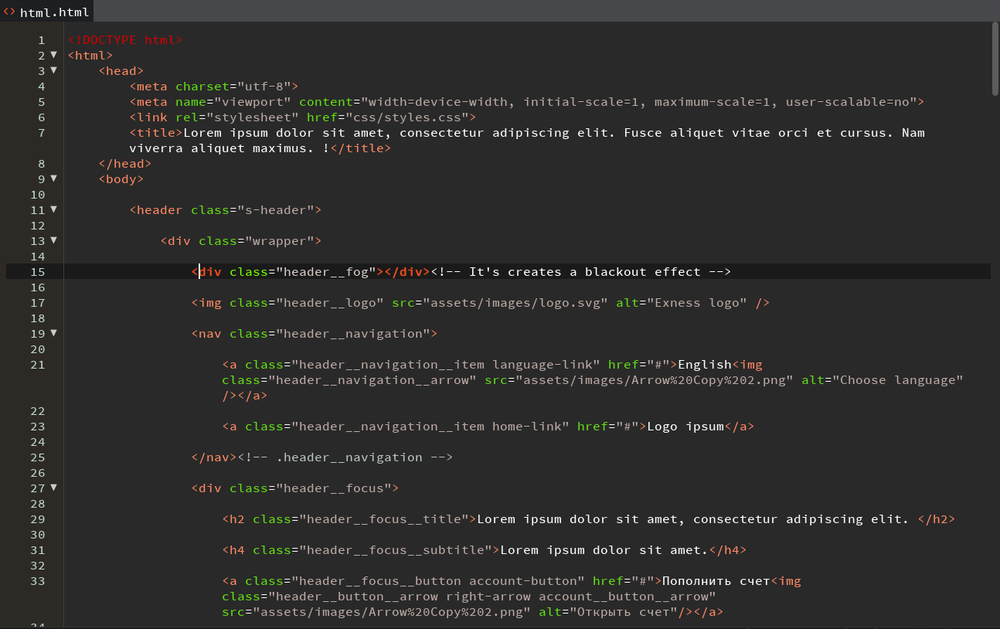

## XML
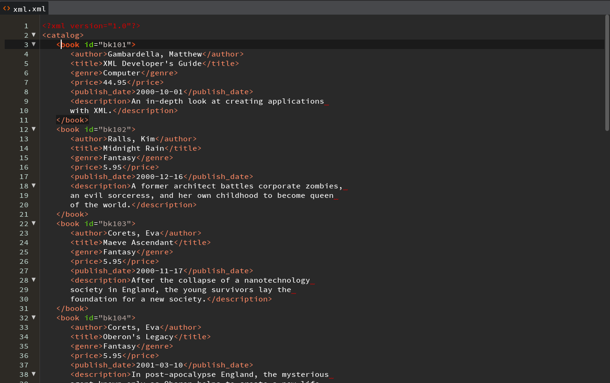

## PHP
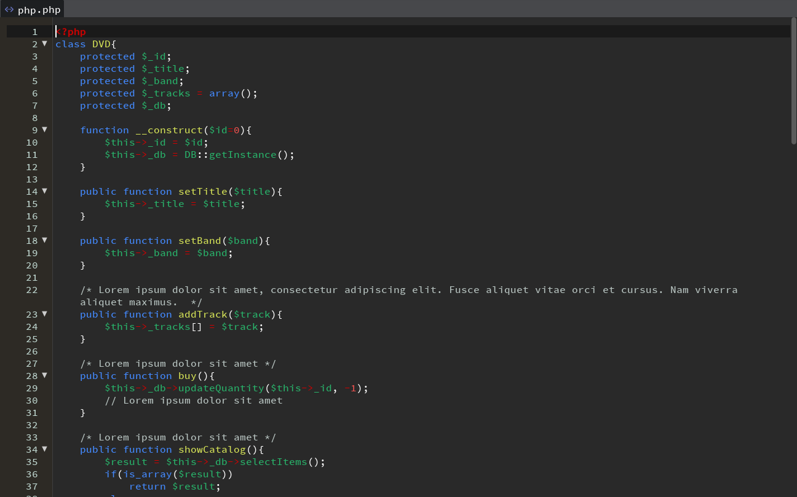

## PHP/HTML
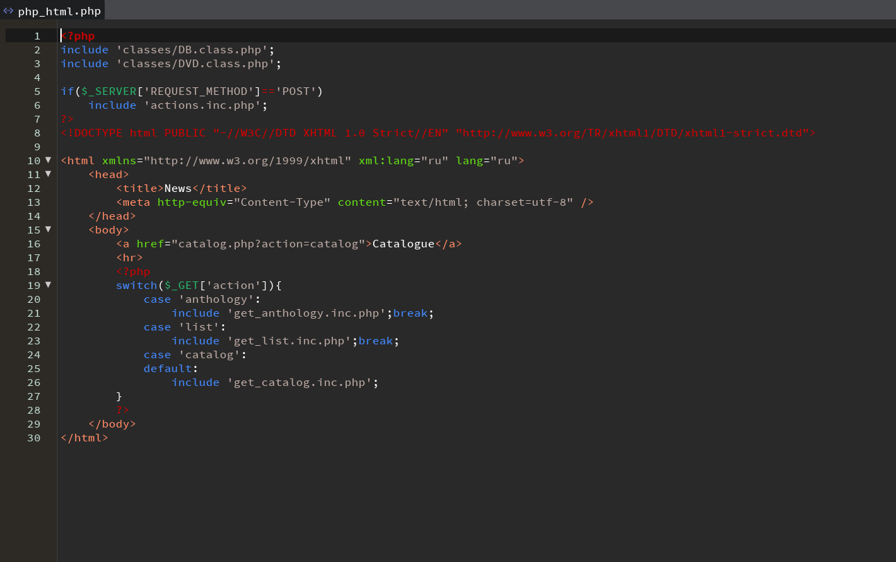

## CSS
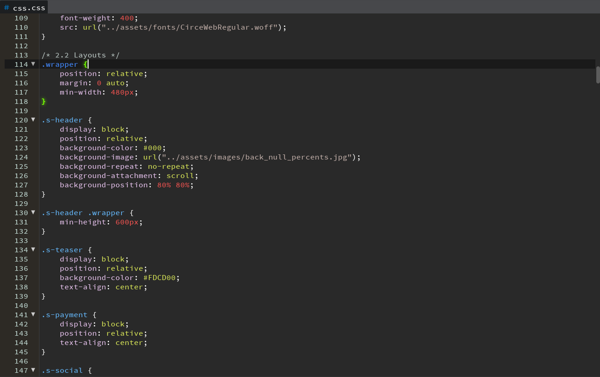

## Sass/SCSS
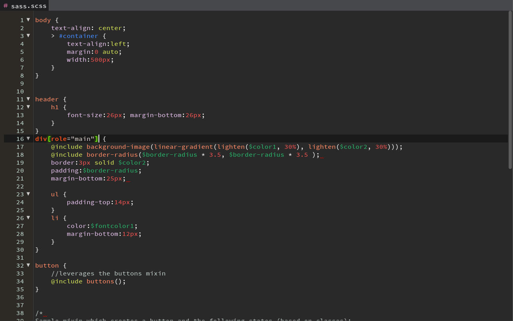

## LESS
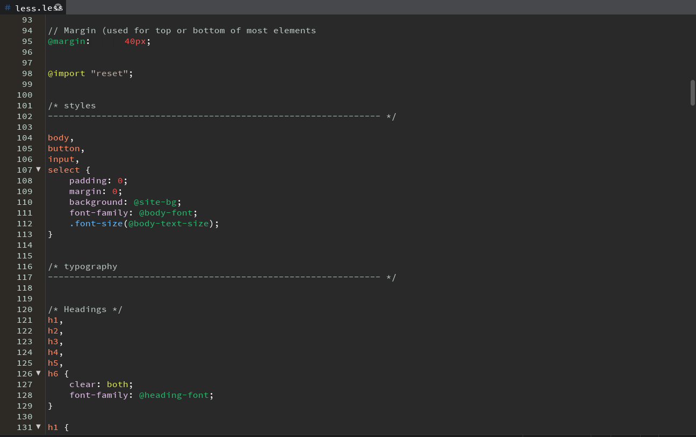

## JavaScript
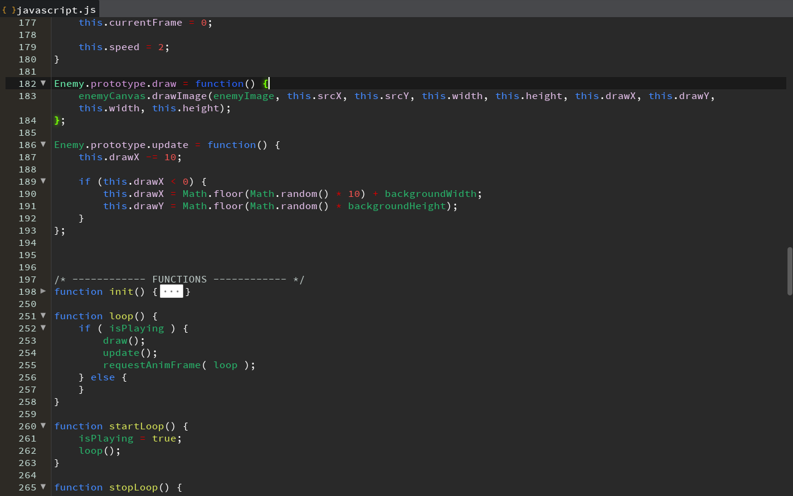

## JSON
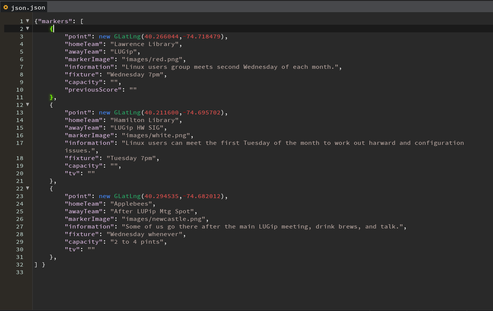

## jQuery
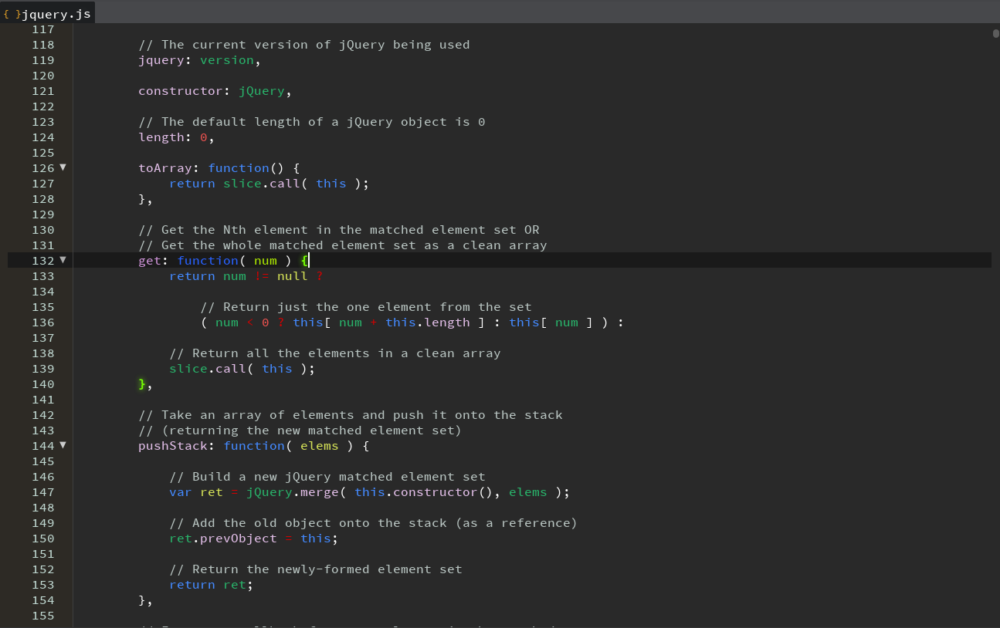

## Markdown
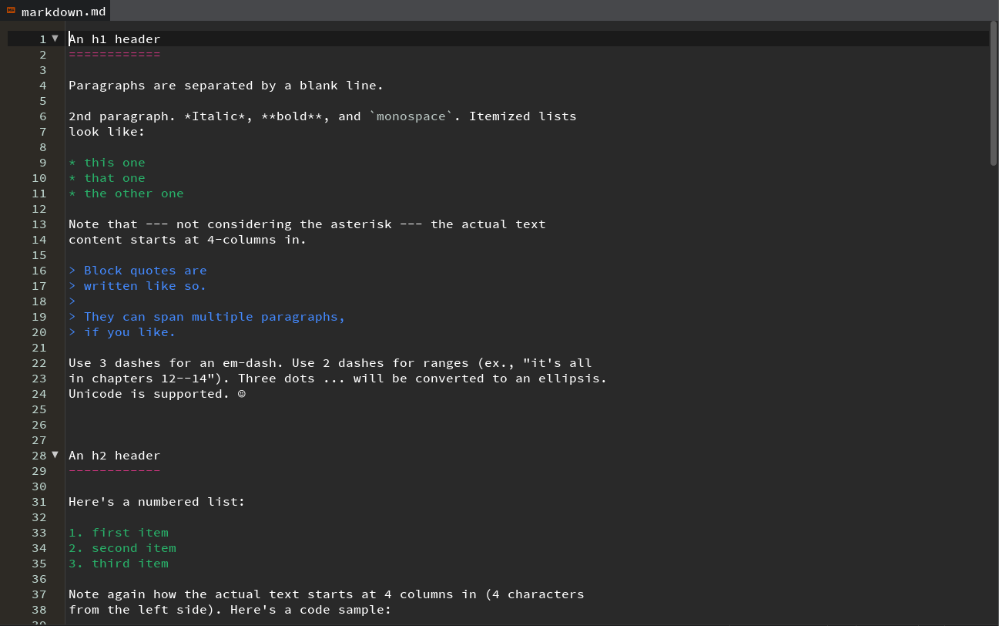

## C++
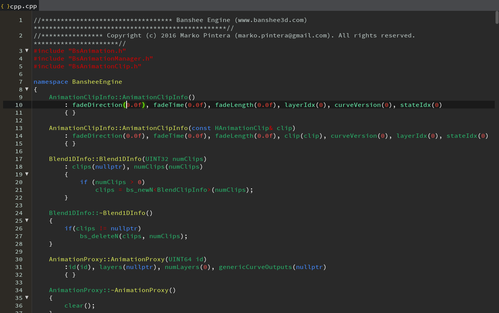

## SQL
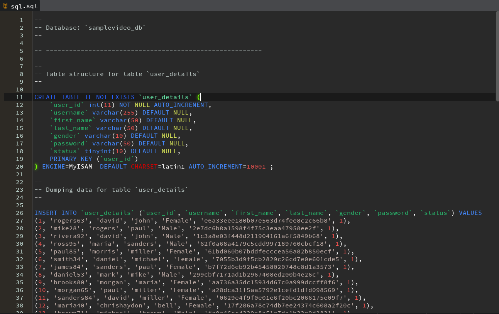

## Image
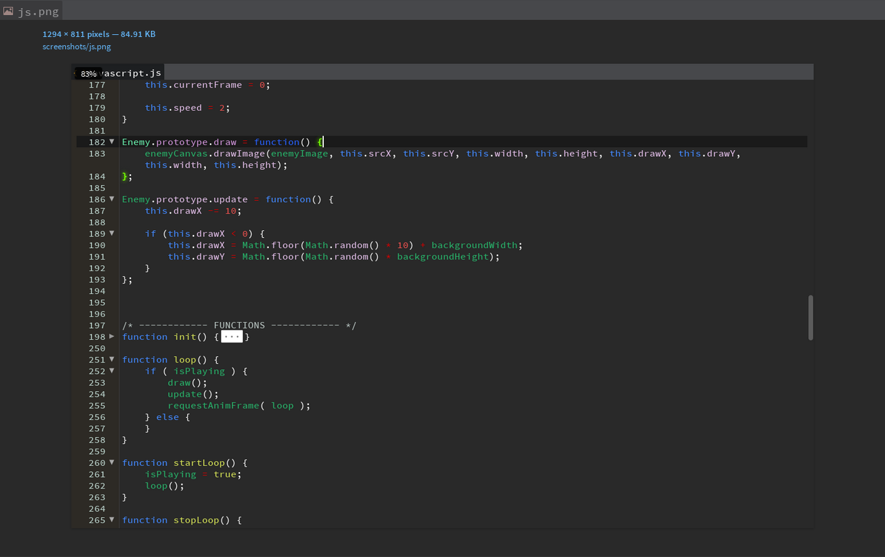

**Gratitudes**
* [Laura Reen](http://laurareen.com/) for logo
* [Ann Void](https://www.facebook.com/anastasia.eliza.soloveva) for review
* [Alyona Tarasova](https://new.vk.com/alenktaras) for review
* [Igor Manelov](https://new.vk.com/holypawer) for review
* [Svetlana Kunova](http://kunova.ru/) for review